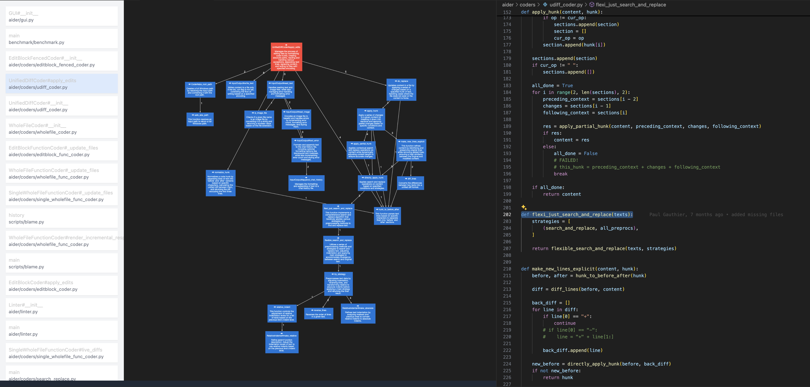

# Code Charter 🧭

## Introduction

Code Charter is a tool designed to enhance the developer experience by transforming complex code into diagrams that distill key user-centric patterns. This tool addresses the need for clearer code understanding and more efficient development processes, enabling developers to think at a higher level and quickly grasp essential patterns in both their own and others' codebases. By visualising code structures, Code Charter aims to accelerate the learning curve and improve code quality.

Currently in development and set to be released soon as a VSCode extension, Code Charter's roadmap includes integrations with coding Agent libraries. These integrations will facilitate greater collaboration by improving the observability and interactivity of AI-powered assistants.

## Getting Started

### Prerequisites

To use Code Charter, ensure you have the following installed and running:

1. **Docker**: Docker is required to manage the containerised environment for Code Charter. You can download and install Docker from [Docker's official website](https://www.docker.com/get-started).

2. **Ollama**: Ollama is necessary for specific functionalities within Code Charter. Make sure Ollama is installed and running on your system. You can find more information and download links on [Ollama's website](https://ollama.com).

### Installation

- **Download the Code Charter Extension**: The extension can be downloaded from the Visual Studio Code marketplace.

   [Download Code Charter Extension (TODO)]()

### Usage

Once installed and configured, you can start using Code Charter to visualise and understand your codebase more effectively. Detailed usage instructions and examples will be available in the official documentation.

## Capabilities

- Detect call graphs in a codebase. 
  - Present these call graphs by node count, assuming the higher nocount call graphs are more important.
- Create summaries of functions and render in a diagram.
- Click on diagram node to navigate to the function in the codebase.
  - This allows developers to quickly move between the high and low levels of abstraction.

## Roadmap

- [ ] Regenerate summaries as the codebase changes.
- [ ] Enable user to edit the summaries.
- [ ] Enable user to delete, merge or add nodes.
- [ ] Enable user to edit the summarisation prompt to refine for specific use cases.
- [ ] Add other summary targets (other than distilling business logic).

### Language Support

This is based on the availability of [SCIP](https://github.com/sourcegraph/scip) parsers.

| Language                    | Supported |
|-----------------------------|-----------|
| Java, Scala, Kotlin         |           |
| TypeScript, JavaScript      |           |
| Rust                        |           |
| C++, C                      |           |
| Ruby                        |           |
| Python                      | ✔         |
| C#, Visual Basic            |           |
| Dart                        |           |
| PHP                         |           |

## How It Works

### High-Level Overview

1. Index the codebase using [SCIP](https://github.com/sourcegraph/scip) protocol
2. Parse the scip index and detect call graphs, output a JSON file containing the call graphs
3. Summarise all the individual functions in the call graphs by via LLM, focusing on business logic.
4. Re-summarise functions alongside their child-node functions to reduce repetition and improve the narrative flow of the diagram.

## License

Mit License, see `LICENSE` for more information.