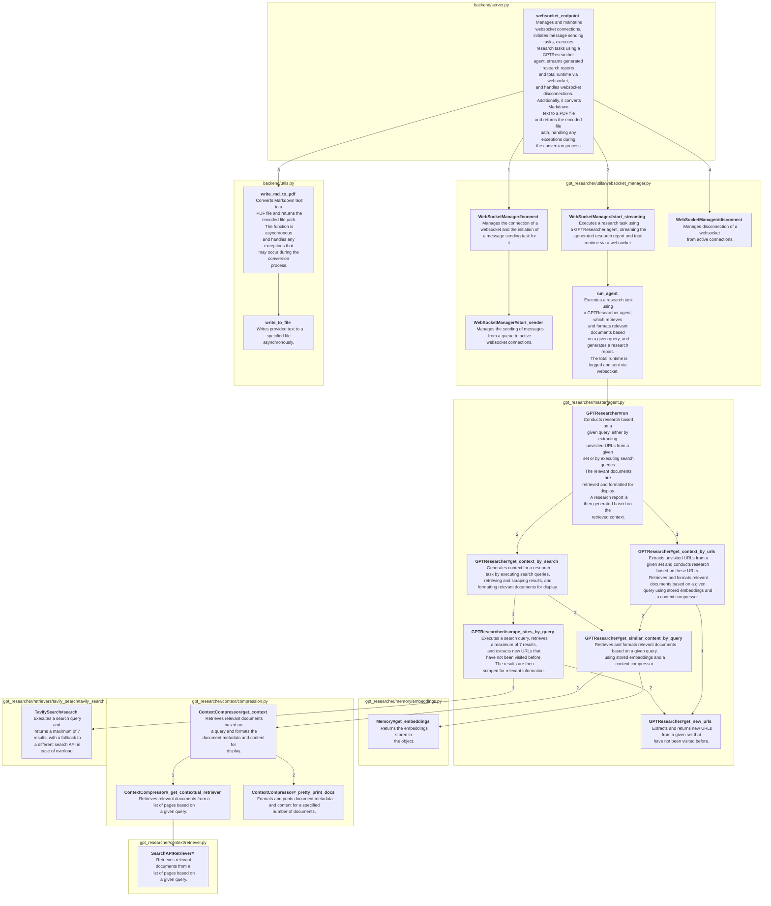

# Code Charter 🧭

## Introduction

Code Charter: The AI-powered tool designed for rapid comprehension of complex code structures.

This project began as a solution to understanding the many new and intriguing code repositories, clarifying their key underlying patterns. It also provides support for managing personal codebases, enhancing documentation, and guiding refactoring for greater clarity. Beyond these applications, the code-summary outputs could be used as input for other AI-driven tools, for example, in building agentic tool libraries.

Code Charter takes a repository as input, parses and summarises it with an emphasis on business logic, and then outputs a flowchart diagram in mermaid format.

## How It Works

1. Index the codebase using [SCIP](https://github.com/sourcegraph/scip) protocol
    - Currently a manual step although `scip/list_python_packages.sh` can be helpful when using [scip-python](https://github.com/sourcegraph/scip-python)
2. Parse the scip index and detect call graphs, output a JSON file containing the call graphs
    - See `cmd/main.go`
3. Recursively summarise the call graphs using OpenAI's API. The summarisation starts with the leaf nodes and works up the call graph, adding the summarised text to the parent node in order to provide more context and reduce the overlap of summarised detail
    - See `summariser/call_graph_to_summary.py`
4. Generate flowchart diagrams from the call graphs in mermaid format
    - See `summariser/call_graph_to_diagram.py`

## Examples

### [gpt-researcher](https://github.com/assafelovic/gpt-researcher) summarised with GPT-4

#### Evaluation

- The summarisation is useful but some function calls are missing
    - Debug call graph detection. Some functions are not being detected by scip-python when they are imported with a wildcard e.g. `from gpt_researcher.utils import *`
- Mermaid layout is not ideal for complex call graphs. Customisable layout would be useful
- It would benefit from displaying control flow - not all functions are called in a linear fashion

## TODO:

### Usability

- [ ] Containerise the steps in the pipeline and orchestrate with e.g. Airflow / Argo / Prefect
- [ ] Create a web interface 
    - [ ] Trigger pipeline 
    - [ ] Trigger summarisation
    - [ ] Display estimated cost of summarisation
    - [ ] Display flow charts in an editable format such as GoJS and enable export
    - [ ] Persist summarisation results and edits

### Functionality

- [ ] Accept a codebase path or URL as input
- [ ] Add a step to the pipeline to detect the language and setup commands for the codebase
- [ ] Add support for more languages (which are supported by SCIP)
- [ ] Summarise with different intents e.g. business logic, implementation details, etc.
    - [ ] Prune the call graph to only include functions that are relevant to the intent / shrink the nodes that are not relevant

### Performance

- Reduce container size for shorter image download times e.g. by using distroless
  - [x] call graph detector
  - [ ] SCIP indexers

## License

Mit License, see `LICENSE` for more information.