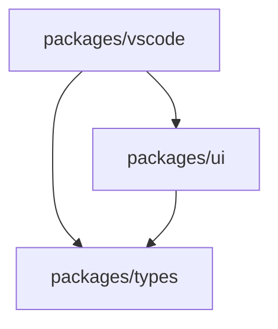

# Code Charter Development Guide

This guide provides comprehensive information for developing Code Charter, including setup, architecture, workflows, and best practices.

## Table of Contents

1. [Architecture Overview](#architecture-overview)
2. [Development Setup](#development-setup)
3. [Development Workflows](#development-workflows)
4. [Debugging](#debugging)
5. [Testing](#testing)
6. [Building and Releasing](#building-and-releasing)
7. [Contributing](#contributing)

## Architecture Overview

Code Charter is organized as a monorepo using:
- **NPM Workspaces** for package management and linking
- **Turborepo** for build orchestration and caching
- **Changesets** for version management and publishing

The monorepo contains three main packages:

```
code-charter/
├── packages/
│   ├── vscode/          # VS Code extension
│   ├── ui/              # Reusable UI components (React)
│   └── types/           # Shared TypeScript types
├── docs/                # Documentation
└── backlog/             # Task management
```

### Package Dependencies



### Key Design Decisions

1. **UI Package Independence**: The UI package can run in multiple contexts (VS Code webview, standalone browser)
2. **Backend Abstraction**: UI communicates through abstract backend interfaces, not direct VS Code APIs
3. **Theme Flexibility**: Automatic detection and adaptation to VS Code themes or standalone themes
4. **Hot Reload Development**: Fast iteration with automatic rebuilds and reloads

### Monorepo Tooling

Our monorepo uses three complementary tools:

#### NPM Workspaces
- **Purpose**: Package management and dependency resolution
- **Configuration**: Root `package.json` with `"workspaces": ["packages/*"]`
- **Benefits**: 
  - Automatically symlinks local packages for development
  - Shared dependencies installed at root level
  - Single `npm install` for entire project

#### Turborepo
- **Purpose**: Build orchestration and task running
- **Configuration**: `turbo.json`
- **Benefits**:
  - Smart caching of build outputs
  - Parallel execution of tasks
  - Dependency-aware task ordering
- **Usage**: All npm scripts use Turborepo under the hood:
  ```bash
  npm run build  # Actually runs: turbo run build
  npm run test   # Actually runs: turbo run test
  ```

#### Changesets
- **Purpose**: Version management and package publishing
- **Configuration**: `.changeset/config.json`
- **Workflow**:
  1. Make changes to packages
  2. Create a changeset: `npm run changeset`
  3. Version packages: `npm run version`
  4. Publish: `npm run release`
- **Benefits**:
  - Automated version bumping
  - Changelog generation
  - Coordinated npm publishing

## Development Setup

### Prerequisites

- Node.js 18+ and npm 9+
- VS Code (latest stable version)
- Git

### Initial Setup

1. **Clone the repository**
   ```bash
   git clone https://github.com/your-org/code-charter.git
   cd code-charter
   ```

2. **Install dependencies**
   ```bash
   npm install
   ```

3. **Build all packages**
   ```bash
   npm run build
   ```

4. **Verify setup**
   ```bash
   npm run typecheck
   npm run lint
   ```

## Development Workflows

### Common Monorepo Commands

```bash
# Install dependencies for all packages
npm install

# Add dependency to specific package
npm install <package-name> -w @code-charter/ui

# Run script in specific package
npm run build -w @code-charter/vscode

# Clean all build outputs
npm run clean

# See Turborepo cache status
npx turbo run build --dry-run
```

### Daily Development Flow

1. **Start the UI dev server**
   ```bash
   cd packages/ui
   npm run dev:all
   ```
   This runs the build watcher and HTTP server concurrently.

2. **Start debugging**
   - Open VS Code at the repository root
   - Press `F5` (uses default debug configuration)
   - A new VS Code window opens with the extension loaded

3. **Make changes**
   - UI changes: Automatically rebuild and reload
   - Extension changes: Restart debug session (`Shift+F5`, then `F5`)

### Working on Specific Packages

#### UI Package Development

```bash
cd packages/ui
npm run dev:all          # Start dev server with hot reload
npm run build            # Build for production
npm run typecheck        # Check TypeScript types
npm run lint             # Run ESLint
```

**Testing UI in isolation:**
- Open http://localhost:3000/demo/index.html
- Uses mock data for rapid iteration
- Full browser DevTools available

#### VS Code Extension Development

```bash
cd packages/vscode
npm run build            # Compile TypeScript
npm run watch            # Watch mode for development
npm run package          # Create .vsix file
```

#### Types Package

```bash
cd packages/types
npm run build            # Compile TypeScript definitions
npm run typecheck        # Verify types
```

### Hot Reload Workflow

The hot reload setup allows you to see UI changes instantly:

1. **Enable Dev Mode** (automatic when debugging)
2. **Make UI changes** → Save file
3. **See changes** in webview immediately

No manual refresh needed!

## Debugging

### Quick Start

**Debug everything with breakpoints:**
1. Select **"Debug UI in Node + Extension"** from debug dropdown
2. Press `F5`
3. Set breakpoints in both packages
4. Debug with full VS Code integration

### Debug Configurations

#### 1. Debug VS Code Extension Only
- Full debugging support for extension code
- Set breakpoints in `packages/vscode/src/**/*.ts`
- Step through extension initialization, commands, etc.

#### 2. Debug UI in Node + Extension
- Runs UI components in Node.js for debugging
- Set breakpoints in both packages
- Three processes run simultaneously:
  - UI debug server (Node.js)
  - UI dev server (webview)
  - VS Code extension

#### 3. Debug Both (Separate Terminals)
- Production-like setup
- Extension debugging with breakpoints
- UI debugging via Chrome DevTools

### Setting Breakpoints

**Extension code:**
```typescript
// packages/vscode/src/extension.ts
export function activate(context: vscode.ExtensionContext) {
  // Set breakpoint here
  const disposable = vscode.commands.registerCommand(...);
}
```

**UI code:**
```typescript
// packages/ui/src/components/code_charter_ui.tsx
export function CodeCharterUI() {
  // Set breakpoint here
  const [state, setState] = useState();
}
```

### UI Debug Entry Point

Customize `packages/ui/src/debug-entry.tsx` to test specific scenarios:

```typescript
// Test specific component states
const testProps = {
  initialData: mockData,
  onError: (e) => console.error(e)
};

// Debug render
const html = renderToString(<YourComponent {...testProps} />);
```

## Testing

### Running Tests

```bash
# All tests
npm test

# Specific package
cd packages/ui && npm test

# Watch mode
npm test -- --watch

# Coverage
npm test -- --coverage
```

### Writing Tests

**UI Component Test:**
```typescript
// packages/ui/src/components/__tests__/code_charter_ui.test.tsx
import { render, screen } from '@testing-library/react';
import { CodeCharterUI } from '../code_charter_ui';

test('renders without crashing', () => {
  render(<CodeCharterUI />);
  expect(screen.getByRole('main')).toBeInTheDocument();
});
```

**Extension Test:**
```typescript
// packages/vscode/src/test/extension.test.ts
import * as vscode from 'vscode';
import { activate } from '../extension';

suite('Extension Test Suite', () => {
  test('Extension should be present', () => {
    assert.ok(vscode.extensions.getExtension('your-publisher.code-charter'));
  });
});
```

## Building and Releasing

### Local Builds

```bash
# Build everything
npm run build

# Build specific package
cd packages/ui && npm run build
```

### Creating a VS Code Extension Package

```bash
cd packages/vscode
npm run package
# Creates: code-charter-x.x.x.vsix
```

### Version Management with Changesets

1. **Create a changeset** after making changes:
   ```bash
   npm run changeset
   # Select changed packages
   # Choose version bump type (patch/minor/major)
   # Write summary of changes
   ```

2. **Update versions** before release:
   ```bash
   npm run version
   # This consumes changesets and updates package.json files
   # Also updates CHANGELOG.md files
   ```

3. **Publish packages**:
   ```bash
   npm run release
   # Builds all packages (via Turborepo)
   # Publishes to npm (via Changesets)
   ```

### Pre-release Checklist

1. **Create changesets** for all changes
2. **Update versions**
   ```bash
   npm run version
   ```

3. **Run all checks**
   ```bash
   npm run lint
   npm run typecheck
   npm test
   npm run build
   ```

3. **Test the packaged extension**
   - Install the .vsix file
   - Test all features
   - Verify in different VS Code versions

### Publishing

```bash
# Publish all packages via changesets
npm run release
# This will:
# 1. Build all packages (Turborepo)
# 2. Publish changed packages to npm (Changesets)

# Publish VS Code extension separately
cd packages/vscode
vsce publish
# Note: VS Code marketplace uses different publishing system
```

### How the Tools Work Together

1. **Development Flow**:
   - NPM Workspaces links packages → Make changes → Turborepo builds efficiently

2. **Release Flow**:
   - Create changesets → Version with changesets → Build with Turborepo → Publish with changesets

3. **Why all three?**:
   - **NPM Workspaces**: Foundation for monorepo structure
   - **Turborepo**: Makes development fast with caching and parallel builds
   - **Changesets**: Professional release management with proper versioning

## Contributing

### Code Style

- TypeScript with strict mode
- Snake_case for variables/functions (except classes: PascalCase)
- ESLint and Prettier for formatting
- Comprehensive JSDoc comments

### Commit Messages

Follow conventional commits:
```
feat(ui): add new visualization mode
fix(vscode): resolve webview loading issue
docs: update debugging guide
chore: upgrade dependencies
```

### Pull Request Process

1. Create feature branch from `main`
2. Make changes following coding standards
3. Add/update tests
4. Update documentation
5. Submit PR with clear description

### Task Management

We use Backlog.md for task tracking:

```bash
# View current tasks
backlog task list --plain

# Start work on a task
backlog task edit <id> -s "In Progress"

# Complete a task
backlog task edit <id> -s "Done" --notes "Implementation details..."
```

## Troubleshooting

### Common Issues

**Extension host timeout:**
- Normal during debugging - wait for attachment

**Port 3000 in use:**
```bash
lsof -ti:3000 | xargs kill -9
```

**UI changes not reflecting:**
1. Check dev mode is enabled
2. Verify dev server is running
3. Try manual webview reload

**Build failures:**
```bash
# Clean and rebuild
npm run clean
npm install
npm run build
```

### Getting Help

- Check existing [GitHub Issues](https://github.com/your-org/code-charter/issues)
- Review [Debugging Guide](./DEBUGGING.md)
- Ask in development chat/forum

## Additional Resources

- [Debugging Guide](./DEBUGGING.md) - Detailed debugging instructions
- [Architecture Decisions](../backlog/decisions/) - Design rationale
- [Task Backlog](../backlog/tasks/) - Current development tasks
- [VS Code Extension API](https://code.visualstudio.com/api) - Official docs
- [React Documentation](https://react.dev) - UI framework docs